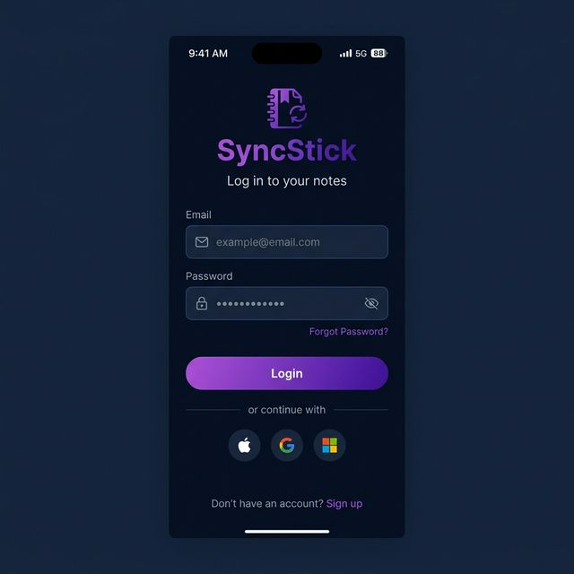
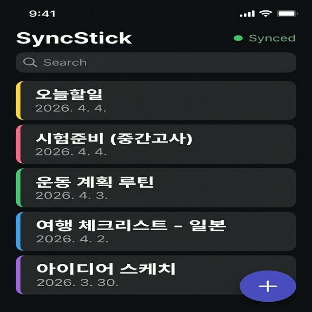
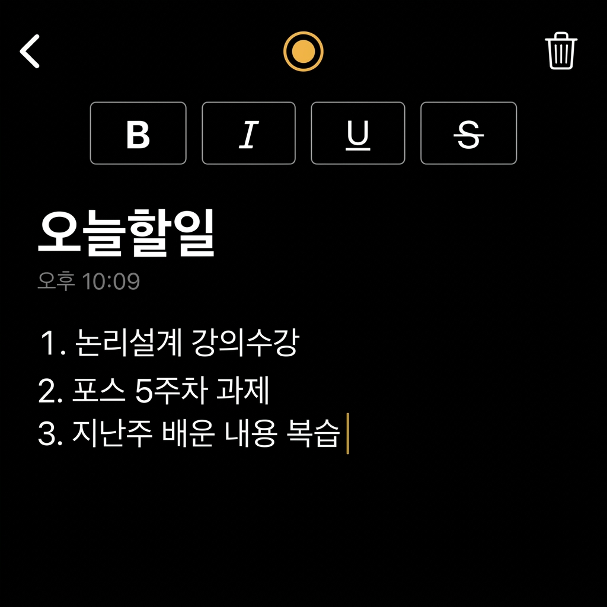

# SyncStick 모바일 앱

실시간 동기화를 지원하는 노트 앱의 모바일 버전입니다.  
데스크탑 앱과 동일한 Supabase 백엔드를 사용하여 어디서든 노트를 작성하고 동기화할 수 있습니다.

---

## 주요 기능

| 기능 | 설명 |
|------|------|
| 📝 **노트 작성/편집** | 리치 텍스트 에디터로 노트 작성, 번호 목록·체크리스트 지원 |
| 🔄 **실시간 동기화** | Supabase Realtime을 통해 데스크탑↔모바일 즉시 동기화 |
| 🎨 **노트 색상** | 노란색, 분홍색, 파란색, 초록색, 보라색 5가지 색상 선택 |
| ✏️ **텍스트 서식** | 굵게(B), 기울임(I), 밑줄(U), 취소선(S) 서식 지원 |
| 📋 **체크리스트** | 할일 체크리스트 생성 및 완료 체크 |
| 🔐 **인증** | 이메일 기반 회원가입/로그인 |
| 🔍 **검색** | 노트 제목 검색 기능 |
| 🗂️ **정렬** | 최신순/오래된 순 노트 정렬 |

---

## 페이지 구성

### 1. 로그인 / 회원가입 페이지

이메일과 비밀번호로 로그인합니다.  
계정이 없는 경우 회원가입 페이지에서 새 계정을 만들 수 있습니다.

- 다크 테마 기반 로그인 화면
- SyncStick 로고 + 이메일/비밀번호 입력
- 로그인/회원가입 전환

<p align="center">
  
</p>

---

### 2. 노트 목록 페이지

모든 노트를 한눈에 확인할 수 있는 메인 화면입니다.

- **상단 헤더**: SyncStick 로고 + 동기화 상태 표시 (● Synced)
- **검색바**: 노트 제목으로 빠르게 검색
- **노트 카드**: 왼쪽 색상 표시줄 + 제목 + 날짜
- **플로팅 버튼**: 우측 하단 `+` 버튼으로 새 노트 생성
- **정렬**: 최신순/오래된 순 정렬 기능

<p align="center">
  
</p>

---

### 3. 에디터 페이지

선택한 노트를 편집하는 화면입니다.

- **상단 툴바**: ← 뒤로가기, 색상 선택 (●), 삭제 (🗑)
- **서식 툴바**: **B** 굵게, *I* 기울임, <u>U</u> 밑줄, ~~S~~ 취소선
- **에디터 영역**: 자유롭게 텍스트 입력 및 편집
- **자동 넘버링**: "1. " 입력 후 엔터 시 자동으로 다음 번호 생성
- **시간 표시**: 마지막 수정 시간 표시

<p align="center">
  
</p>

---

## 기술 스택

| 항목 | 기술 |
|------|------|
| 프레임워크 | React + TypeScript |
| 상태 관리 | Zustand |
| 서버/DB | Supabase (PostgreSQL + Realtime) |
| 데이터 페칭 | TanStack Query (React Query) |
| 데스크탑 빌드 | Tauri v2 |
| 스타일링 | Vanilla CSS |

---

## 설치 및 실행

```bash
# 의존성 설치
npm install

# 개발 서버 시작
npm run dev

# Tauri 데스크탑 앱 실행
npm run tauri dev
```

### 환경 변수

`.env` 파일에 Supabase 설정이 필요합니다:

```env
VITE_SUPABASE_URL=your-supabase-url
VITE_SUPABASE_ANON_KEY=your-supabase-anon-key
```
